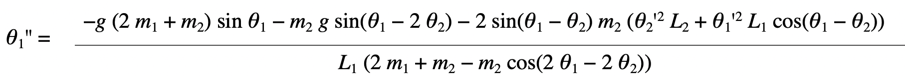
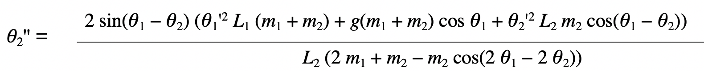

# 雙擺運動模擬
### 1. 根據自己電腦版本打開application.windows64或application.windows32/DoublePendulum.exe
### 2. 左方為各項數據
### 3. 功能說明:
>   - 啟動模式選擇:
>     - \<F10> : 一組雙擺
>     - \<F11> : 二組雙擺
>     - \<F12> : 三組雙擺
>   - 參數修改:
> 
> >  par. | m1 | m2 | r1 | r2 | M1 | M2 | R1 | R2 | Mm1 | Mm2 | Rr1 | Rr2 |
> > |:-:|:-:|:-:|:-:|:-:|:-:|:-:|:-:|:-:|:-:|:-:|:-:|:-:|
> > inc. | Q | E | T | U | A | D | G | J | 1 | 3 | 5 | 7 |
> > dec. | W | R | Y | I | S | F | H | K | 2 | 4 | 6 | 8 |
> 
> - 數據重設:delete
> 
> - 畫面清除:C
> 
> - 暫停:任何按鍵(保留空白鍵)
### 4. 擷取圖片
> - 單個雙擺
> 
> 
> 
> 
> - 三個雙擺
> 
> 

# 運動方程式
> ##### Begin by using simple trigonometry to write expressions for the positions x1, y1, x2, y2 in terms of the angles θ1, θ2 .
> > x1 = L1 sin θ1
> > y1 = −L1 cos θ1
> > x2 = x1 + L2 sin θ2
> > y2 = y1 − L2 cos θ2
> 
> ##### The velocity is the derivative with respect to time of the position.
> > x1' = θ1' L1 cos θ1\
> > y1' = θ1' L1 sin θ1\
> > x2' = x1' + θ2' L2 cos θ2\
> > y2' = y1' + θ2' L2 sin θ2
> 
> ##### The acceleration is the second derivative.
> > x1'' = −θ1'2 L1 sin θ1 + θ1'' L1 cos θ1	 ------	(1)\
> > y1'' = θ1'2 L1 cos θ1 + θ1'' L1 sin θ1	 ------	(2)\
> > x2'' = x1'' − θ2'2 L2 sin θ2 + θ2'' L2 cos θ2  	------  (3)\
> > y2'' = y1'' + θ2'2 L2 cos θ2 + θ2'' L2 sin θ2	------  (4)
> ##### Forces in the Double Pendulum
> > m1 x1'' = −T1 sin θ1 + T2 sin θ2	 	 ------	(5)\
> > m1 y1'' = T1 cos θ1 − T2 cos θ2 − m1 g	 ------	(6)\
> > m2 x2'' = −T2 sin θ2					 ------	(7)\
> > m2 y2'' = T2 cos θ2 − m2 g	 			 ------	(8)\
> > m1 x1‘’ = −T1 sin θ1 − m2 x2‘’	 	 	 ------	(9)\
> > m1 y1‘’ = T1 cos θ1 − m2 y2‘’ − m2 g − m1 g	------ 	(10)
> ###### Direct Method for Finding Equations of Motion
> > T1 sin θ1 cos θ1 = −cos θ1 (m1 x1'' + m2 x2'')		 ------	(11)\
> > T1 sin θ1 cos θ1 = sin θ1 (m1 y1'' + m2 y2'' + m2 g + m1 g)	 ------	(12)\
> > sin θ1 (m1 y1'' + m2 y2'' + m2 g + m1 g) = −cos θ1 (m1 x1'' + m2 x2'') 	 ------	(13)\
> > T2 sin θ2 cos θ2 = −cos θ2 (m2 x2'') 	 ------	(14)\
> > T2 sin θ2 cos θ2 = sin θ2 (m2 y2'' + m2 g) 	 ------	(15)\
> > sin θ2 (m2 y2'' + m2 g) = −cos θ2 (m2 x2'') 	 ------	(16)
> ##### Angular Equations of Motion
> 
> 
> 
> 

